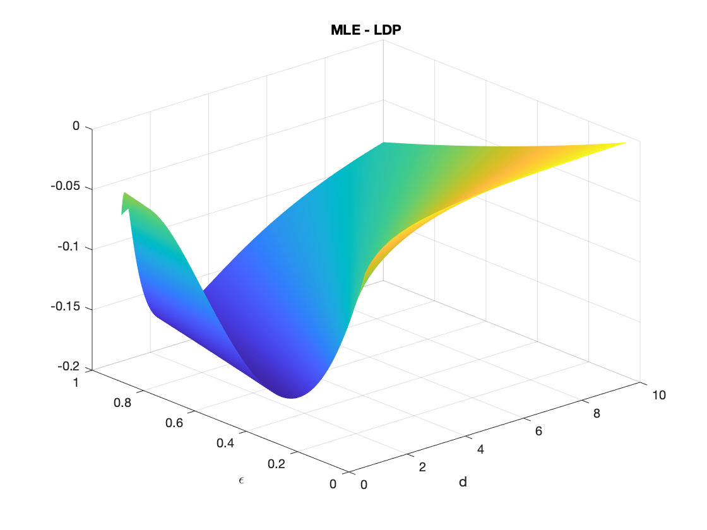

[Back](./blog.md)

## Interesting(-ish) Interview Question

So, while I was looking for jobs this summer, I encountered this question: If I give you samples from a uniform distribution distributed along the interval $$(0, d)$$, how do you find $d$? 

My nervous adrenaline-packed brain started its scambled search through my statistics database. I immediately replied: "I remember that the maximum likelihood estimate for $$d$$ is the max out of all samples." I was quite confident in this answer as I can still recall some details in the derivation. However, the interviewer rejected my answer (politely, of course) and asked me to think about the expectation of the uniform distribution. The second answer became obvious given this hint: the expectation of a uniform distribution with support $$(0,d)$$ is $$d/2$$ and the typical averaging would do the job (upon rescaling). 

I was a bit bamboozled because maximum likelihood estimates are, well, _maximum likelihood_ estimates. If we're given a uniform distribution without specifying the lower bound, the trick would not have worked. I thought to myself, as the interviewer had spent more time on this question than I had, he's probably right. And we moved on. 

So, I'll dedicate this blog to finding out who's more right. I'll present three views before presenting the big reveal. _If you're reading this page and find anything wrong with the following calculations, please let me know and I would be happy to fix/try out your suggestion_. 

With that being said, let's begin with a formal problem statement: given $$n$$ i.i.d. samples of random variable $$X$$ that is uniformly distributed along the support $$(0,d)$$, where $$d$$ is uknown, estimate $$d$$. 

### Method 1: the classic MLE

We assumed i.i.d. samples (makes my life easy), meaning that the likelihood function looks like the product of marginals. 

$$
\begin{align}
\mathcal L(d) &= \prod_{i=1}^n \frac{1}{d} 1_{(0,d)}(x_i) \\
&= \frac{1}{d^n} \prod_i 1_{(x, \infty)}(d) \\
&= \frac{1}{d^n} 1_{(\max \{x_i: i \in [n]\})}(d)
\end{align}
$$

where $$1_A(x)$$ is the indicator function ($$1$$ if $$x \in A$$ and $$0$$ otherwise). The second equality is by squinting: we get $$1$$ if $$0 \leq x_i \leq d$$, or equivalently in the $d$-parameter-space, $$x_i \leq d < \infty$$. The third equality is by noticing that only the biggest $$x_i$$ win. We want the maximum likelihood estimate, which I'll denote with a rather weird (but less confusing notation because I don't want $$d$$'s floating all over) $$\mathcal E_1$$ for being the first estimate I write down. 

$$ \mathcal E_1 = \max_{d \in \mathbb R} \mathcal L(d)$$

Notice that the likelihood function is $$0$$ before $$\max \{x_i\}$$ and monotonically decreasing (and positive) for $$d > \max \{x_i\}$$, so the maximum occurs if we catch it first jumping up to something non-zero and before it starts eroding away. 

$$ \mathcal E_1 = \max \{x_i: i \in [n]\}$$ 

Great! My memory was performing well despite having to catch a flight at 7 in the morning. Now, we want to look at how good this estimator is. To do so, we would look at the probability that our estimate lies outside of the true parameter by some $$\epsilon$$. For the MLE, we can use some results from order statistics (or by basic probability arguments).

$$\mathbb P (\mathcal E_1 > x) = 1 - \mathbb P (X \leq x)^n$$

So: 

$$
\begin{align}
\mathbb P(\vert \mathcal E_1 - d \vert < \epsilon) &= \mathbb P(\mathcal E_1 > d - \epsilon) \\
&= 1 - \mathbb (X \leq d - \epsilon)^n \\
&= 1 - \left(1 - \frac{\epsilon}{d} \right)^n 
\end{align}
$$

We actually got quite a good bound (in fact, an exact and non-asymptotic one!) describing how $$\mathcal E_1$$ behaves: the probability that the deviation is larger than some $$\epsilon$$ decreases exponentially with $$n$$. That's darn fast! My intuition says that this is hard to beat, but we can't declare winners just yet without a fair treatment of the interviewer's proposal. 

### Method 2: a heuristic argument from CLT

Taking averages of samples immediately brings me to the Central Limit theorem. This was the first thought I had when I got onto the Lyft after the interview. We know that by (the illegal version of) CLT, we have the following.

$$ \mathcal E_2 = 2\frac{1}{n} \sum_i X_i \sim \mathcal N \left( d, \frac{d^2}{6n} \right) $$ 

which converges in distribution in the large sample limit. This seems to converge a bit slower than exponential, at least without any calculations carried out. The argument I had without pen and paper is to grab the Chebyshev bound, which sits comfortably on the top of my head (most of the time). 

$$ \mathbb P(\vert \mathcal E_2 - d \vert > \epsilon) \leq \frac{d^2}{6n \epsilon^2} $$

which is a significantly worse bound considering both the $$\mathcal O(1/n)$$ rate with sample size and $$\mathcal O(1/\epsilon^2)$$ with my tolerated error bound. However, with some care and large deviation theory, we would get a similar exponentially vanishing tail bound. We will not do it here because we don't have to do a large deviation on an approximate Gaussian! 

### Method 3: large deviation principle to the rescue

I'm just reading about large deviation on Weinan E, Tiejun Li, Eric Vanden-Eijnden's _Applied Stochastic Analysis_ (I just started, but really enjoying so far), so this is an exciting experiment. For some i.i.d sum of random variable $$S_n = \sum_i X_i/n$$ and any (bounded) set $$\Gamma$$, the large deviation principle (Cramer's theorem) says that 

$$ \mathbb P(X \in \Gamma) \asymp \exp \left( -n \inf_{x \in \Gamma} I(x) \right) $$ 

where $\asymp$ represents logarithmic equivalence $$I(x)$$ is the Legendre transform of the cumulant.

$$ I(x) = \sup_\lambda \{ \lambda x - \Lambda (\lambda) \} = \sup_\lambda \{ \lambda x - \log \mathbb E e^{\lambda X} \} $$

That's a lot of optimization! Let's shift and rescale $$X$$ so that we're estimating the mean of random variable that is uniformly distributed from $$-d$$ to $$d$$. Then, we can go through some calculations to find out that the rate function looks (cough cough) kind of ugly. 

$$ I(x) = \sup_\lambda \left \{\lambda x - \log \frac{e^{\lambda d} - e^{-\lambda d}}{2\lambda d} \right \} $$ 

Let's not panick just yet. Let's pin-point $$\Gamma$$ first. Cramer's theorem actually splits into tight upper and lower bounds, and the upper bound requires $$\Gamma$$ to be a closed set. In our case, we can confidently pick $$\Gamma = [-d, \epsilon] \cup [\epsilon, d]$$ because we have a bounded distribution. Generally, we can do optimization over one tail such as $$[\epsilon, \infty)$$. Why? My justification is that when we take infimum over $$\Gamma$$, by convexity and non-negativity of the rate function, the $$x$$ that we pick will always be at the lower boundary, which we can then take the limit of closed sets shifting the upper bound up. This is known by fellow engineers as the _Chernoff bound_, which is obtained by applying the Markov inequality on exponentiated random variable. From this persepctive, we get to know that 1) the large deviation result is actually not an asymptotic reesult, which makes the comparison with MLE apples-to-apples, we can obtain an upper bound on the deviation probability by looking at one side of the tail and multiply by two later rather than having to with gut feeling on taking infimum over $$\Gamma$$. 

Now, to optimize over $$\lambda$$, we can pick any $$\lambda$$ to obtain a sufficient bound. Even that is difficult, however, because the cumulant is just in an ugly form. But for the sake of keep going, let's write down what we have so far. 

$$ \mathbb P(\vert \mathcal E - d \vert > \epsilon) = 2 \exp(-n I(\epsilon)) = 2 \left( -I(\epsilon) \right)^n$$ 

### Final Verdict

So, since we get exponential concentrations on both estimators, let's look at how the rate constants differ, that is, the thing inside the "to-the-$$n$$" exponent. To evaluate the rate function fairly, I numerically solved for the optimum with a simple gradient descent procedure. I look at how the difference in the constants as I vary both $$\epsilon$$ and $$d$$, and below is the result. 

And (drum roll, please) ... __we have a winner__! Since the difference stayed below, LDP wins! However, it seems like in the appropriate limit, the two estimators are the same. Nonetheless, LDP did not fail me and I did end up with a slightly better bound. I did give the less-right answer in the interview, but the difference is small, so I forgive myself for this. 

